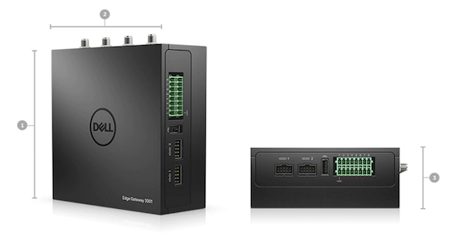

# Dell Edge Gateway 3002 specifications

## Recommended hardware specifications

<table>
  <tr>
    <td>Type</td>
    <td>Configuration Parameter</td>
    <td>Suite</td>
    <td>Service</td>
    <td>Use Case</td>
    <td>Remark</td>
  </tr>
  <tr>
    <td>Dell-Edge   Gateway 3002</td>
    <td>CPUE3805/Mem:   2G/Storage:8G SSD/OS Ubuntu core 16</td>
    <td>WIFI-No/3G/4G-No/SD   Card-No/No Other installation kit</td>
    <td>3years   pro-support</td>
    <td>Wired   Connection</td>
    <td>Support   PoE Power Source, Power adapters need additional purchases.</td>
  </tr>
  <tr>
    <td>Dell-Edge   Gateway 3002</td>
    <td>CPUE3805/Mem:   2G/Storage:8G SSD/OS Ubuntu core 16</td>
    <td>WIFI-No/3G/4G+antenna/SD   Card-No/No Other installation kit</td>
    <td>3years   pro-support</td>
    <td>3G/4G   Connection</td>
    <td>Support   PoE Power Source, Power adapters need additional purchases.</td>
  </tr>
  <tr>
    <td>Dell-Edge   Gateway 3002</td>
    <td>CPUE3805/Mem:   2G/Storage:8G SSD/OS Ubuntu core 16</td>
    <td>WIFI+antenna/3G/4G-No/SD   Card-No/No Other installation kit</td>
    <td>3years   pro-support</td>
    <td>Wi-Fi   Connection</td>
    <td>Support   PoE Power Source, Power adapters need additional purchases.</td>
  </tr>
</table>

For more information about the hardware specifications, see the [Dell](https://www.dell.com/en-us/work/shop/cty/pdp/spd/dell-edge-gateway-3001/ctoi3002stdus?ref=1689_plt_title).

## Processing capacity

Supports concurrent processing of 3000 data tags per second.

In real cases, the edge does not need to ingest and process data tags for all acquisition points every second. Therefore, this model could support ingestion of about 5000 data tags in most cases. Contact Envision EnOS Support for detailed consultation.
