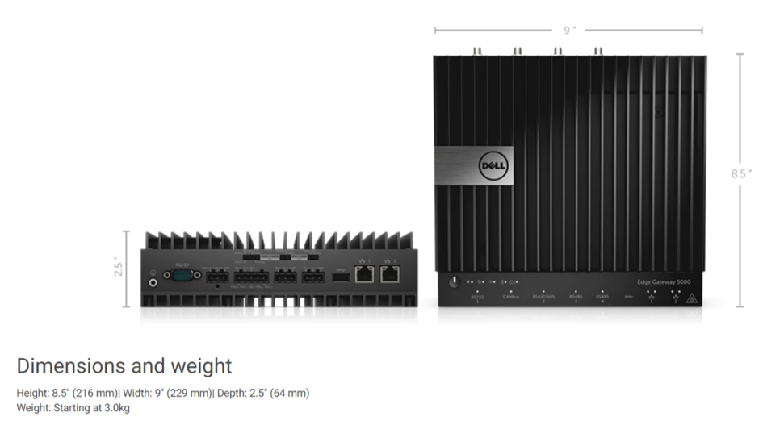

# Dell Edge Gateway 5000 specifications

## Recommended hardware specifications

<table>
  <tr>
    <td>Type</td>
    <td>Configuration Parameter</td>
    <td>Suite</td>
    <td>Service</td>
    <td>Use Case</td>
    <td>Remark</td>
  </tr>
  <tr>
    <td>Dell-Edge Gateway 5000</td>
    <td>CPU E3825/Mem:   4G/Storage:128G SSD/OS Ubuntu core 16</td>
    <td>WIFI-No/3G/4G-No/Power   Expansion Module</td>
    <td>3years pro-support</td>
    <td>Wired Connection</td>
    <td>Power Expansion Module is   optional, and note that there are two kinds of Power module to choose-DIN   Rail or Wall</td>
  </tr>
  <tr>
    <td>Dell-Edge Gateway 5000</td>
    <td>CPU E3825/Mem:   4G/Storage:128G SSD/OS Ubuntu core 16</td>
    <td>WIFI-No/3G/4G+antenna/Power   Expansion Module</td>
    <td>3years pro-support</td>
    <td>3G/4G Connection</td>
    <td>Power Expansion Module is   optional, and note that there are two kinds of Power module to choose-DIN   Rail or Wall</td>
  </tr>
  <tr>
    <td>Dell-Edge Gateway 5000</td>
    <td>CPU E3825/Mem:   4G/Storage:128G SSD/OS Ubuntu core 16</td>
    <td>WIFI+antenna/3G/4G-No/Power   Expansion Module</td>
    <td>3years pro-support</td>
    <td>Wi-Fi Connection</td>
    <td>Power Expansion Module is   optional, and note that there are two kinds of Power module to choose-DIN   Rail or Wall</td>
  </tr>
</table>

For more information about the hardware specifications, see the [Dell](http://www.dell.com/en-us/work/shop/gateways-embedded-computing/edge-gateway-5000/spd/dell-edge-gateway-5000/xctoi5000us).

## Processing capacity

Supports concurrent processing of 8000 data tags per second.

In real cases, the edge does not need to ingest and process data tags for all acquisition points every second. Therefore, this model could support ingestion of about 12000 data tags in most cases. Contact Envision EnOS Support for detailed consultation.
