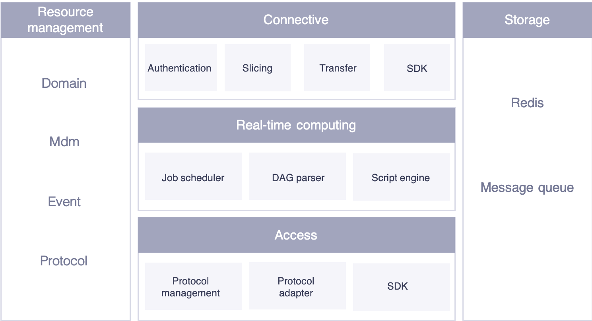

# EnOS Edge overview

Envision EnOS™ Edge is the data ingestion front end of the EnOS IoT Platform. It is used to ingest data from on-site devices or 3rd party systems and transfer data to the EnOS Cloud.

EnOS Edge is a software application. It supports data ingestion, local
storage, and breakpoint resumption. The Edge software can be installed
in various hardware to meet different project requirements about
performance, costs, security, brand and so on.

## Functional Characteristics

As the data acquisition front end of EnOS IoT platform, EnOS Edge is
featured with the follow functional characteristics:

**Fast device connection**

- With the device model library and optimized configuration process provided by EnOS IoT platform, users can configure device connection in a short time.

- With the Web Configuration Center, device accessing, communication testing, data verification and maintenance can be done remotely and easily.

**Device control**

After the device model was defined with control functionalities and control data tags in the EnOS Cloud, the Edge supports receiving control commands from the cloud and sends to the device.

**Automatic synchronization with the cloud**

As the functionality extension of the EnOS Cloud, EnOS Edge runs as an individual application and works with the cloud compatibly as well.
Under the condition of smooth network and the necessary open ports, Edge
can:

- Synchronize device telemetry to the cloud automatically.

- Update device models in the cloud automatically (or manually).

- Download resource packages from the cloud automatically, including configuration files, communication files, etc.

**Breakpoint resumption**

- In case of network interruption between the Edge and cloud, the Edge can cache data automatically during the interruption and resume data upload starting from the breakpoint when the connection recovers. The sequence of data uploading is from old to new data.

- The data cache capability of the Edge depends on the hardware configuration. For details about the calculation method, refer to the documentation in [Breakpoint resumption](edge_specification/breakpoint_resumption).

**Centralized remote control**

- The web-based Configuration Center supports remote communication configuration, data debugging, and device connection.

- In condition of smooth network connection and open ports, the Edge supports remote application upgrade, configuration parameter modification, etc.

- The cloud monitors real-time performance of each edge and the connected devices, and provides APIs for third party application development.

**Open and rich protocol library**

EnOS Edge provides a rich protocol library, which supports connection of almost all the devices currently used by the power industry. Meanwhile, it provides developers on EnOS Developer Center with open protocol development capabilities. Developers can develop protocols based on
their business requirements, and then upload the protocols to the developer center and synchronize them to the Edge.

## Software Architecture

*Figure: Edge Software Architecture*
