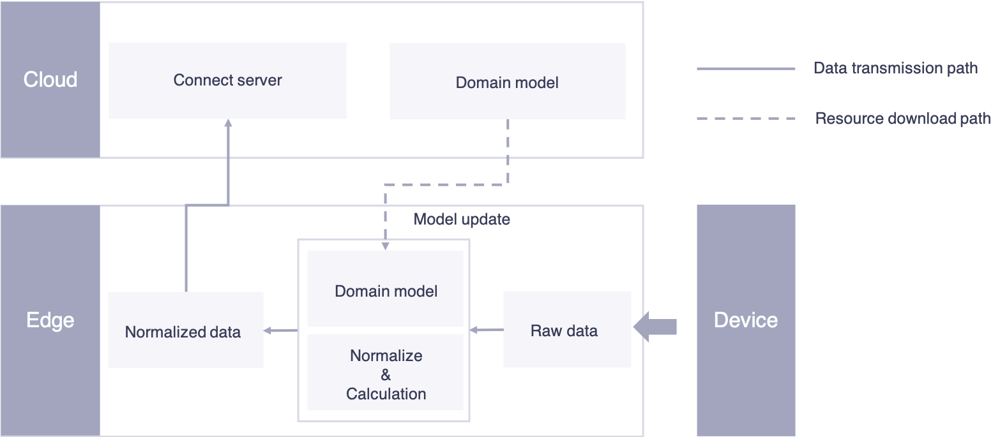

# Data normalization

After data ingestion, another core function of the EnOS Edge is to
normalize the raw data using the device model downloaded from the cloud.
Raw data will be mapped to the standard data schema of each device
instance in the platform.

*Figure: Data Processing Flow in EnOS Edge*

As shown in the above figure, the data normalization process includes:

1. Ingest raw data via the communication protocol.

2. Map the raw data to the standard data schema that is defined in the device model. The Edge can update the device model defined in the Cloud platform in real time so as to ensure that models in the Edge are up to date.

3. In the process of model mapping, many formulas and calculations are often needed. For example, raw data "**Ra**" needs to be calculated by function "**f**" and mapped to standard data schema "**Da**", which is **Da=f(Ra)**. Besides providing some conventional formulas, the EnOS Edge also enables users to create calculation scripts for the domain standard data tags to process some complicated calculation scenarios.

4. After processing, computing, and mapping, the raw data are mapped to the standard domain model data tags, and then transferred to the cloud platform.
