# Configuring edge connection

Device connection requires linking the device to the corresponding
device template and configuring corresponding communication parameters.

Typical process of configuring edge connection is shown as below:

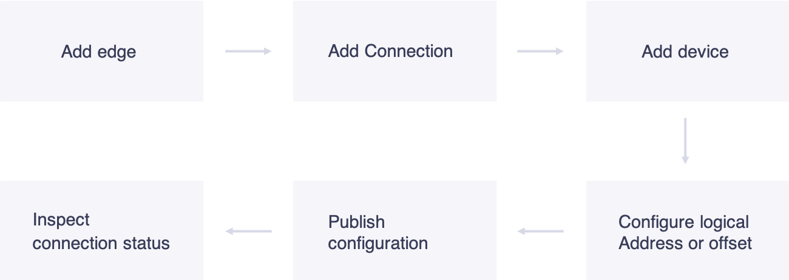

*Figure: Process of configuring communication*

After publishing the configuration to the edge end, if there is any
abnormal data, debug the communcationt to ensure that the data can be correctly sent to the cloud on time.

The following figure shows the main page of the **Access Center**. The sites of the customer end are listed in this page.

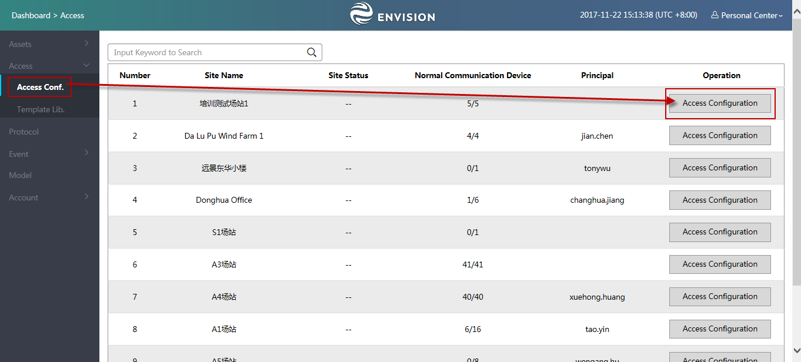

*Figure: Main page of Access Center*

## Adding edge

Device connect to the EnOS Cloud through the edge. The edge can be a
physical server deployed on the site or a virtual server in the cloud.
The edge can only be recognized by EnOS Cloud after getting a legal
serial number (SN).

To add edge, do:

1.  Click **Access Conf.** in the navigation bar on the leftside.

2.  Click the **Access Configuration** of the site to be edit.

3.  Click Add Box in the Access Configuration page .

4.  The following window pops up. Enter the edge name and SN.

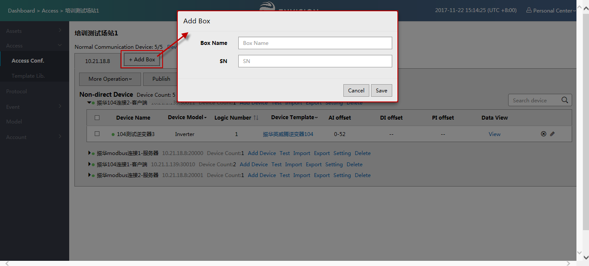

*Figure: Pop-up windows of adding edge*

Generally, one site only needs one edge. And one edge can only be
connected with limited amount of points. For large-sized site, as it
contains lots of point , several edges should be added. The system
administrator should inform the user that how many edges are required
and how many devices can be connected to each edge. The conclusion
should be based on the number of the sites and sampling frequency
provided by the user.

## Adding connection

To add connection to the edge, do the following steps:

1. Click Add Connection in the Access Configuration window.

2. Fill the field in the pop up window.

You need to check whether the connection mode is HTTP or TCP/IP. If it is TCP/IP, corresponding IP address and port number need to provided and the number of the device linked to need to be configuration.

In the below example, edge is used as TCP/IP customer end. So that the configured connection parameters are the IP address and port number of the server.

**Note**: Generally, the edge is not directly connected to the end
server or device. Edge is connect to a network gateway and then connect to end server or device. Therefore, you need to know the IP address and port number of the network gateway.

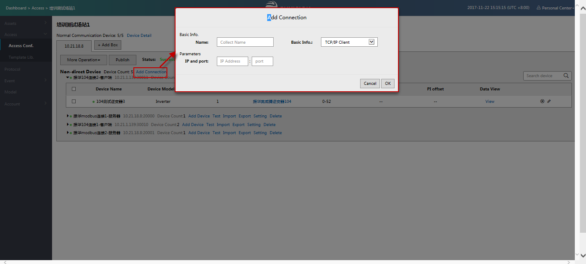

*Figure: Example of adding connection*

**Note:** According to the actual needs, several connections can be
added under one edge according to the type of the protocol and the type of the edge.

## Adding and managing device information

### Adding devices

To add devices, do the following steps:

1. Click **Add Device** as below.

   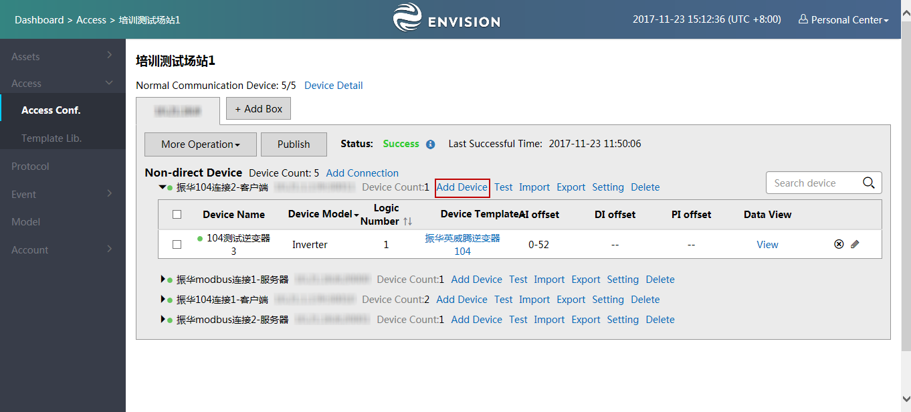

   *Figure: Adding device*

2. In the pop up window, select the devices of the same type.

3. Select the device template to be connected in the **Connection template config** seciton.

4. Click **Save.**

   **Note:** You need to select device first and then select the device template.

   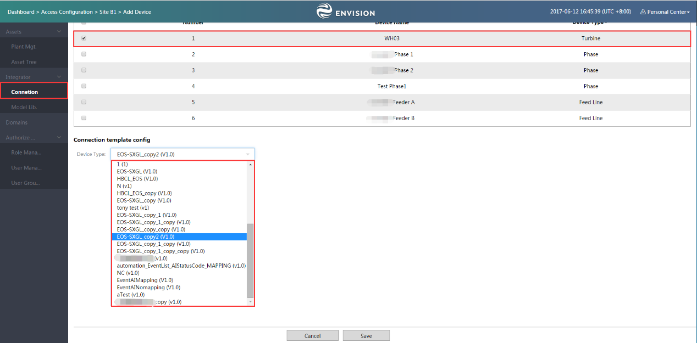

   *Figure: Adding devices and connection template*

### Modifying the information of the devices

If the device information need to be update, do:

1. Click **Export** of the device to be modified to export the **Device
    template table**.

   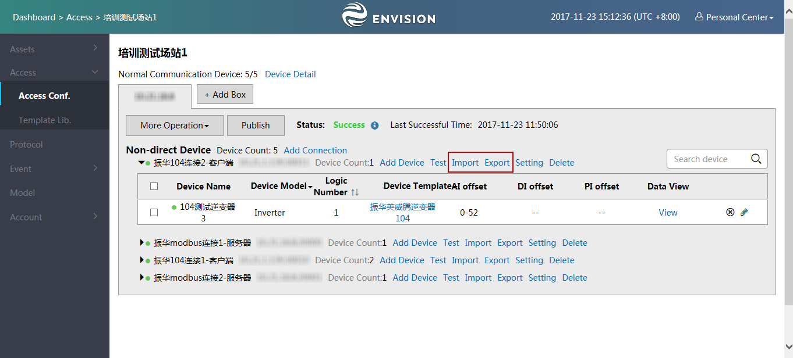

   *Figure: Updating the information of the devices*

2. Update the information in the table.

   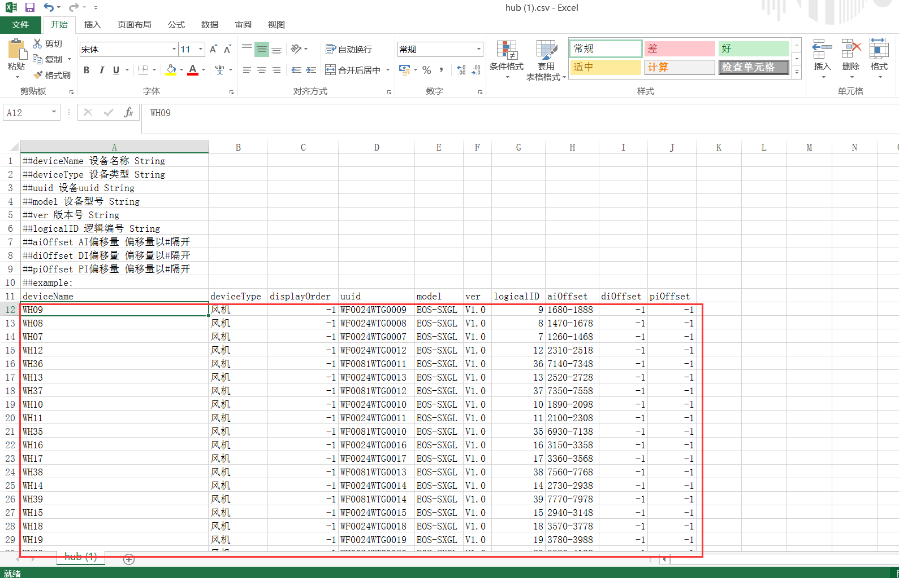

   *Figure: Device template table*

3. Click **Import** to import Device template table.

### Deleting the device

- To delete a devcie, do: Click 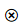 of the device to be deleted.

- To delete several device in batch, select the devices to be deleted under the connection and click **Delete** above the table.

  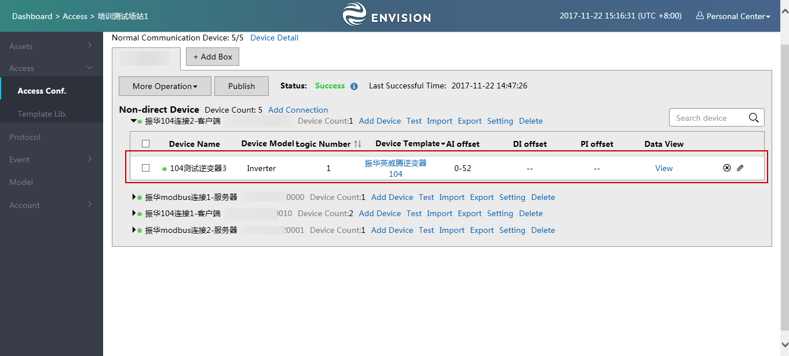

  *Figure: Delete devices in batch*

## Configuring logical address or offset

Because multiple devices are associated to one connection, the logical address and corresponding offset should be configured for each device.
The configuration of each device depends on the adopted communication protocol and its settings. You can configure you device one by one or in batches by update the **Device template table**.

### Configuring device one by one

To configure the device one by one, do the following steps:

1. Click  icon of the device to be edit as below:

   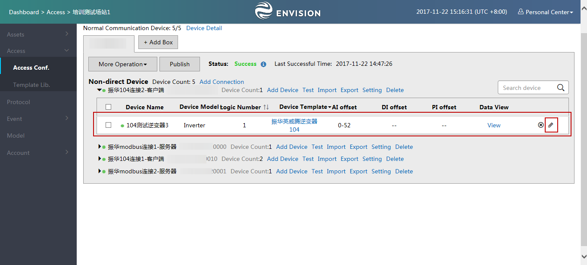

   *Figure: Configure the logical address and offset for Device Individually*

2. Edit the configuration according to your requirement and then click **OK.**

   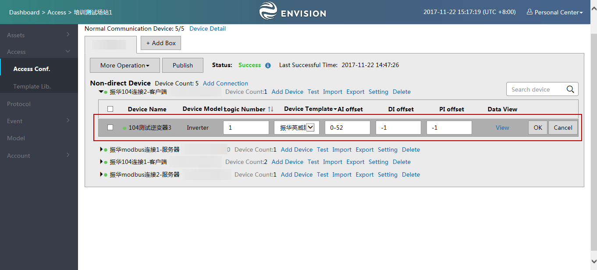
   *Figure: Edit the logical Address and offset for a device*

### Configuring devices in batches

To configure devices in batches, do the following steps:

1. Click **Export** in the window, download the Device template table.

2. Update the information in the table as shown below:

3. Click **Import** to upload the Device template table.

   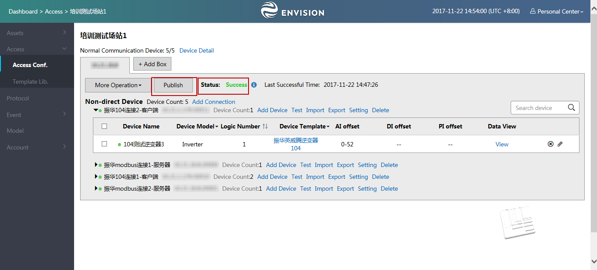

   *Figure 4‑13: Device template table*

**Note:** The exported table supports the configuration of **AI, DI, PI, AO, DO, PO** offset. The basic configuration method is use dashline(-) to connect, e.g 0-50. Multiple values are separate the value by semicolon(;) e.g.0-50;1000-1000.

## Publishing configuration

To publish the configuration to the edge, do the following steps.

1. Click **Publish** to publish the configuration to the corresponding edge.

2. You can check the status of the publish. If the status shows **Success** as below, it means configuration is published and has taken effected.

   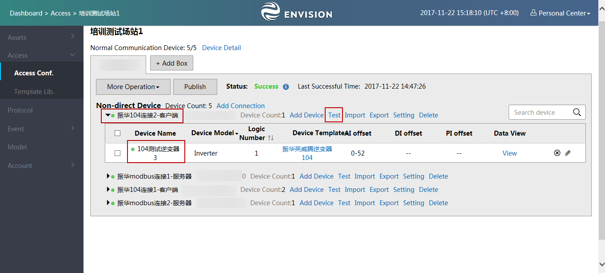

   *Figure: Publish Configuration to Edge*

## Testing communication

After completing theconfiguration and publishing configuration to the edge, you need to inspect whether the configuration works or not. To test the communication, do the following steps:

1. Go to the Access Configuration page.

2. If the indicator before the device name is green, it means the device connection in the transimmion layer(TCP/IP layer) is connected.

3. If the indicator before the device name is red, it means the connection in the transimmion layer(TCP/IP layer) is interrupted.

   

   *Figure: Communication in the Transmission Layer is Interrupted*

## Debugging

The possible reasons of communication interruption are:

- The configuration is not published

- The configuration is wrong

- The site end communication is abnormal.

Therefore you need to debug to diagnose the problem. EnOS provides the
communication test function to help achieve the goal.

To debug the communicaton, do the following steps:

Click **Test** as shown below and enter the batch test page of the link,
which is as shown in Figure as below.

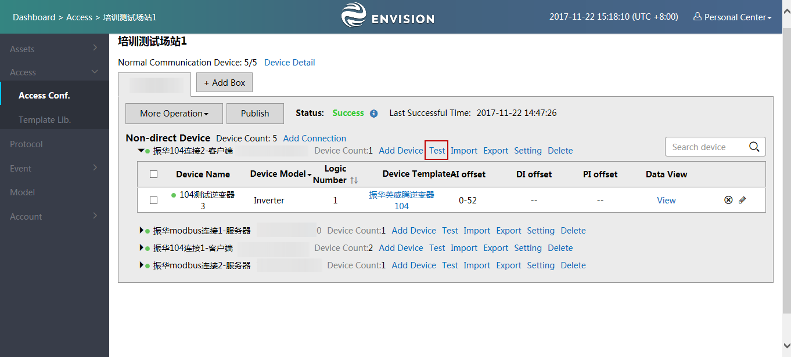

*Figure: Batch Test Function*

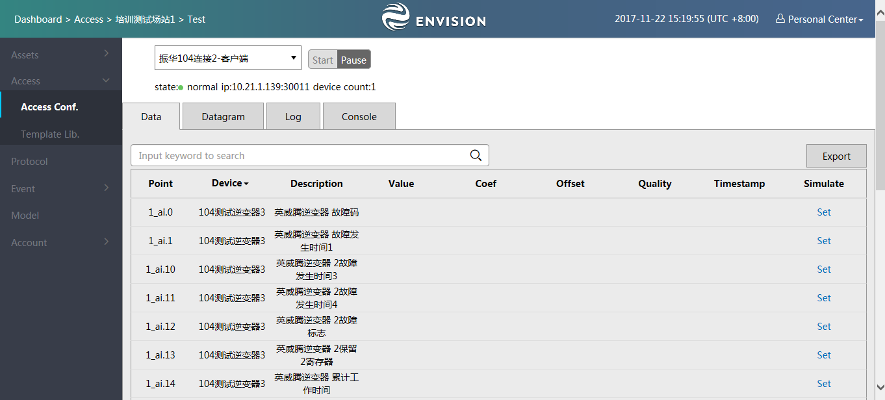

*Figure: Batch Communication Test Page*

The debugging page allows you to perform the following operations:

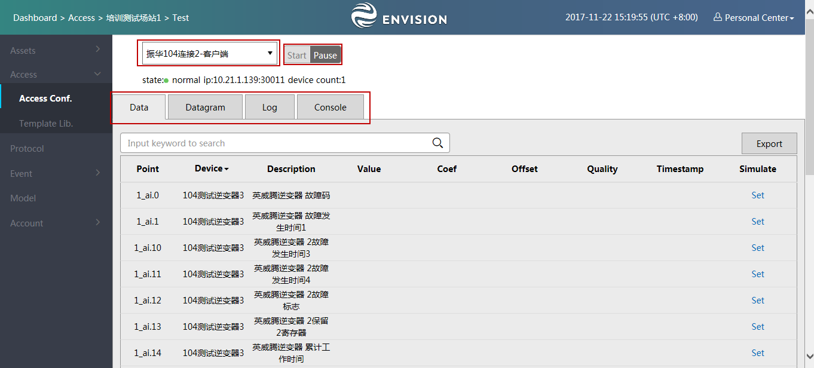

*Figure: Overview of Batch Communication Test*

You can switch the link in the below fields and the corresponding
connection parameters under the fields.

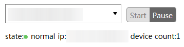

*Figure: Conversion of Links*

You can click **Start / Pause**, to start or pause the communication
test function.

Batch test provides four functions :data, original message, log and console. Click corresponding Tab pages to convert different functions, which is shown in the following figure:

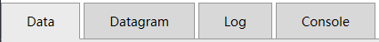

*Figure: Conversion of Communication Test Functions*

### Data

In this tab, you can view all device under this link, filter the device and view the update information of collection point data in the edge.

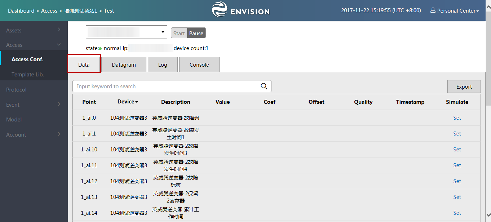

*Figure: Data Tab*

#### Setting number

Support to set numbers for the telemetry and telecommand points.

1.  Click **Set** to set the value.

2.  Click **Send** to send the set value to the cloud. Click once to send once and it will not interrupt the uploading of the former data, which is equivalent to inserting of a new value to the cloud.

    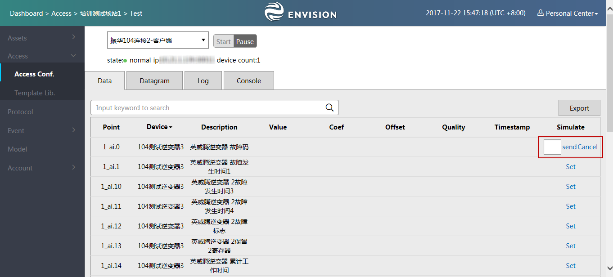

    *Figure: Setting number*

### Datagram

In this tab, you can view the incoming and outgoing messages. The
messages can be copied.

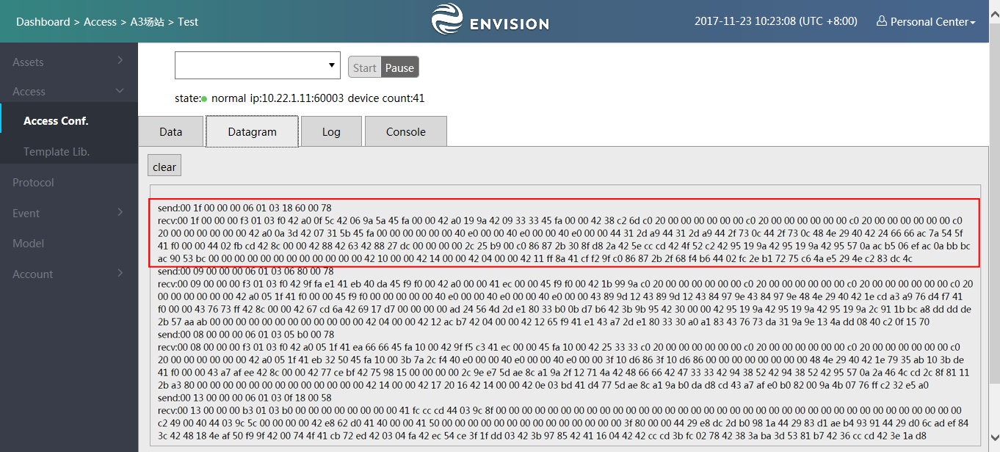

*Figure: Datagram tab*

### Log

In this tab, you can view the warning and error types of logs to
disgnosis the communication failure. Informational logs are hidden,

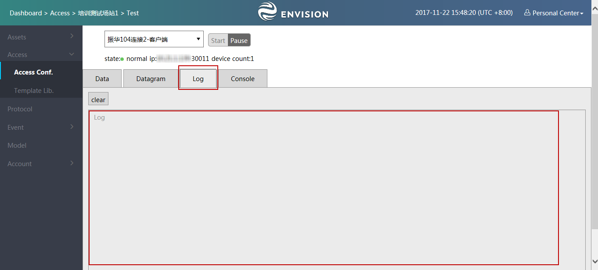

*Figure: Log Function*

### Console

In this tab, the most frequently used debugging orders are built in,
including:

- Ping (You'll need to enter the IP address to ping)

- Check local IP.

- Telnet (You'll need to enter the IP and port number)

- View TCP connection

*Figure: Console Function*

### Testing the communication of single device

In the access center, click **View Data** for a single device to perform communication test and view the data of the edge to which the device is connected.

You can also view data for multiple devices. The single device
connection test is consistent with that of batch test.

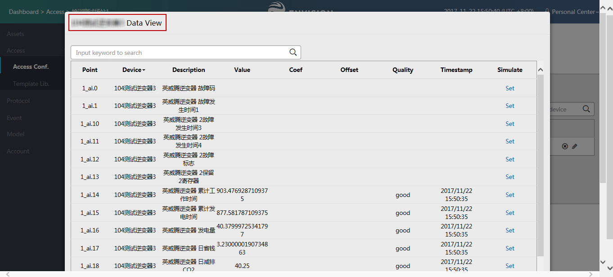

*Figure: Communication Test Function of Single Device*
